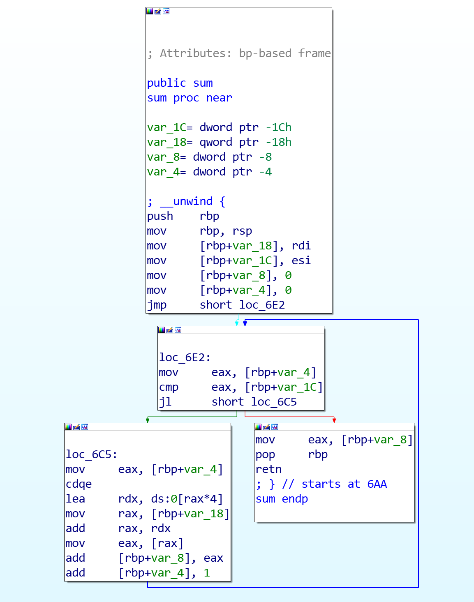
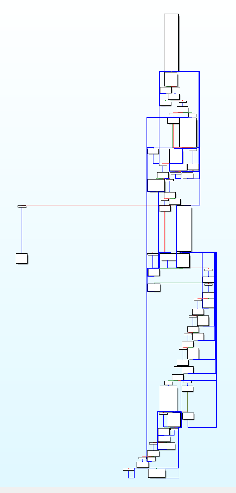

# CodeObfs
一个基于LLVM Pass机制，对LLVM IR进行定制的混淆器。  
# 序言  
为了研究和学习VMP虚拟机壳，本来是想设计实现一套虚拟指令。马上要思考几个问题：  
1、是编译式的还是补丁式的？  
2、如果是补丁式的，那么实现哪种架构，ARMv7、ARMv8还是X86？  
3、如果是编译式的，如何做到后端生成自己的虚拟指令？  
...  
自然而然的LLVM就进入了视野，如果能够通过LLVM IR语言描述出一套虚拟指令，那么就免去自己去实现后端的麻烦，并且一举通过LLVM实现跨平台。
# 设计思想
本项目完全按照论文
https://dspace.cvut.cz/bitstream/handle/10467/82300/F8-DP-2019-Turcan-Lukas-thesis.pdf 中《4.1 Lightweight VM Pass》章节设计实现。即将函数中每个BasickBlcok的每一条指令，都分解为一个新的单独的BasicBlock，然后分配一个单独的命令码。将命令码按一定顺序存储起来，让PC通过命令码执行对应的BasicBlock，以此实现一种称之为LigthtWeight VM的混淆，本质上有点类似控制流平坦化。
# 编译及使用
## 编译及环境搭建
推荐使用ubuntu，clang需要单独安装，如果本机安装过LLVM发布版本，尽量卸载掉
```
apt install clang
```
下载llvm 11.0.0源码，解压并进入
```
wget https://github.com/llvm/llvm-project/releases/download/llvmorg-11.0.1/llvm-11.0.1.src.tar.xz
tar xvf llvm-11.0.1.src.tar.xz
cd llvm-project-11.0.1.src
```
进入llvm-project-11.0.1.src//llvm/lib/Transforms
```
git clone https://github.com/bigBestWay/CodeObfs.git
```
同时修改CMakeLists.txt，增加一行
```
add_subdirectory(CodeObfs)
```
在llvm-project-11.0.1.src目录下创建build目录
```
mkdir build
cd build
```
这里要求cmake的版本较高，一般要源码编译自行安装
```
cmake ../llvm
```
make编译，这里PC配置一定要足够，内存至少8G、硬盘至少100G，CPU越强越好
```
make -j8
```
## 执行
编译成功后，会在llvm-project-11.0.1.src/build/lib目录生成LightVM.so。  
为了方便使用，设置环境变量$LLVM_HOME=/path/llvm-project-11.0.1.src，将build/bin目录添加到PATH
```
export LLVM_HOME=/root/llvm-project-11.0.1.src
export PATH=$LLVM_HOME/build/bin:$PATH
```
接下来执行混淆过程，以如下代码文件为例
```
//add.c
#include <stdio.h>

int sum(int * a, int len) __attribute((__annotate__(("LightVM"))))
{
    int result = 0;
    for(int i = 0; i < len; ++i)
        result += a[i];
    return result;
}

int main()
{
    int a[5] = {1,2,3,4,5};
    printf("%d\n", sum(a, 5));
    return 0;
}

```
注解LightVM用来表明该方法执行混淆，不写注解就不会混淆。  

通过clang编译生成IR中间代码文件
```
clang -S -emit-llvm add.c -o add.ll
```
调用LightVM Pass对IR进行修改
```
opt -S -load $LLVM_HOME/build/lib/LightVM.so -vmobfs add.ll -o add2.ll
```
将修改后的IR生成本地代码文件
```
llc -filetype=obj add2.ll -O0 -o add.o
```
ld执行链接，生成完整ELF
```
gcc -O0 -o add_obf add.o -no-pie
```

混淆前后call graph对比：
  
  


# 参考资料
https://www.praetorian.com/blog/extending-llvm-for-code-obfuscation-part-1/  
https://dspace.cvut.cz/bitstream/handle/10467/82300/F8-DP-2019-Turcan-Lukas-thesis.pdf  
https://llvm.org/docs/WritingAnLLVMNewPMPass.html  
https://blog.csdn.net/feibabeibei_beibei/article/details/88804755  
https://blog.csdn.net/qq_42570601/article/details/108059403  
https://anoopsarkar.github.io/compilers-class/llvm-practice.html  
https://www.jianshu.com/p/0567346fd5e8  
https://llvm.org/docs/LangRef.html  
感谢以上作者的分享！  
